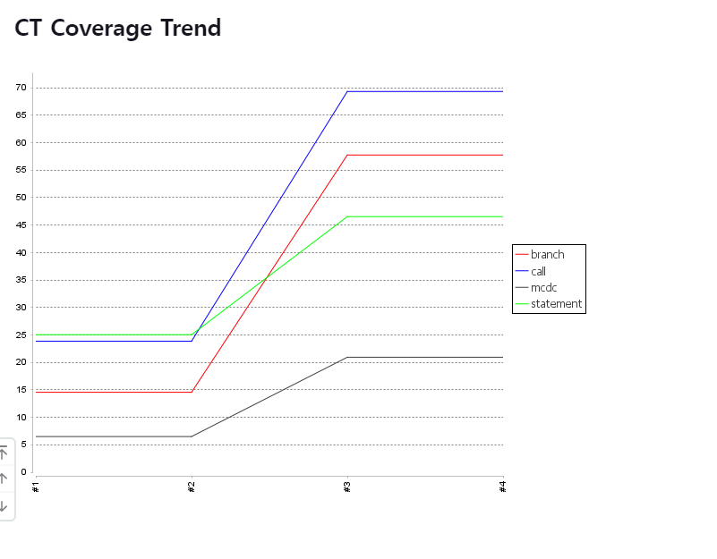
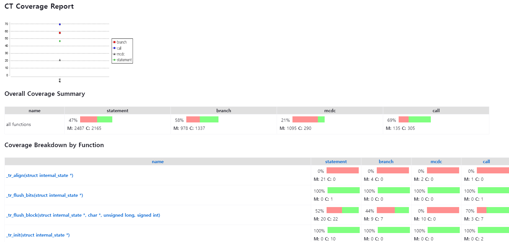
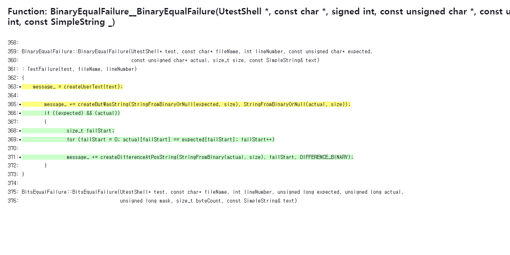

CT Coverage
=============

Displays code coverage results for test run results for CT projects.

This plugin is a fork of the Jacoco. All files, including existing and new components, are MIT licensed.

Usage
===========================================
This plugin reads the exported coverage results of the CT project that ran the test and displays coverage figures and graphs.
Clicking on the ‘Coverage Trend’ menu will display a full page coverage trend graph.

The coverage report provides coverage information for each function.

When you click on a function, you can view the source code for the function definition and the coverage information visualized in the source code editor.

